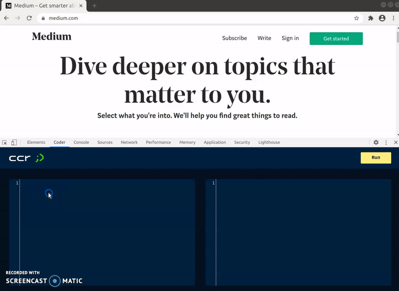

# Chrome Code Runner

A chrome extension that extends DevTools to allow you to embed JavaScript and CSS
into an active window. 

## Uses

Especially useful for Embedded UI and client-side AB testing.

## Screenshot



## Installation

The extension is not yet distributed in extension stores.

### Loading the unpacked extension

Grab the repo and run 

```
npm install
npm run-script build
```

Navigate to `chrome://extensions/` in your browser and 

- ensure that *Developer mode* is enabled. 
- choose *Load unpacked* 
- navigate to the dist/ folder in the root of this project's folder

## Todo

- Save code in storage per host 
- Add enabled toggle
- Replace btoa with a better serializer handling non-utf8 chars
- Refactor panel.js to lib and fix crappy tests :'(
- CRX builds and distribution
